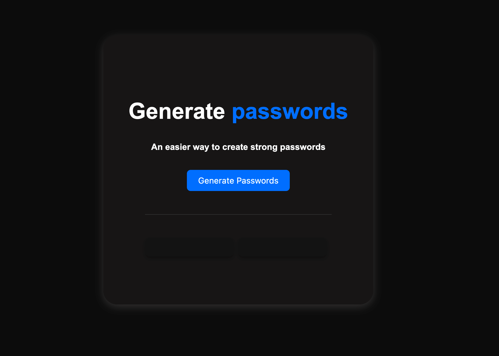

# Random Password Generator



This is a simple random password generator web application built using HTML, CSS, and JavaScript. It allows you to generate two passwords simultaneously with a dark-themed user interface.

## Features

- Generates two random passwords with a length of 12 characters each.
- Dark-themed user interface for a modern look.

## Getting Started

1. Clone this repository or copy the HTML, CSS, and JavaScript code.
2. Open the `index.html` file in a web browser.
3. Click the "Generate Passwords" button to generate two random passwords.

## Customization

You can customize the password length and character set by modifying the `generatePassword` function in the JavaScript code.

```javascript
function generatePassword() {
  const length = 12; // Change this to your desired password length
  const charset =
    "abcdefghijklmnopqrstuvwxyzABCDEFGHIJKLMNOPQRSTUVWXYZ0123456789!@#$%^&*()_+";

  let password = "";
  for (let i = 0; i < length; i++) {
    const randomIndex = Math.floor(Math.random() * charset.length);
    password += charset[randomIndex];
  }

  return password;
}
```
